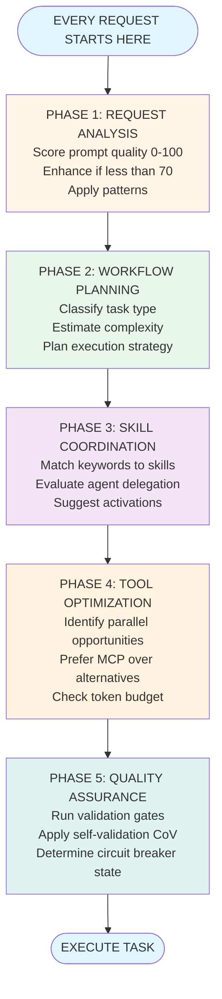
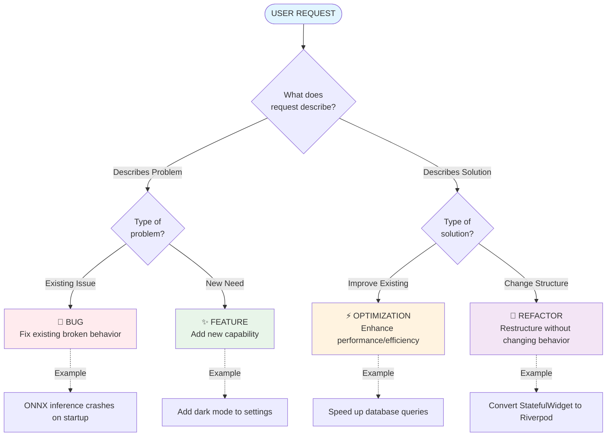
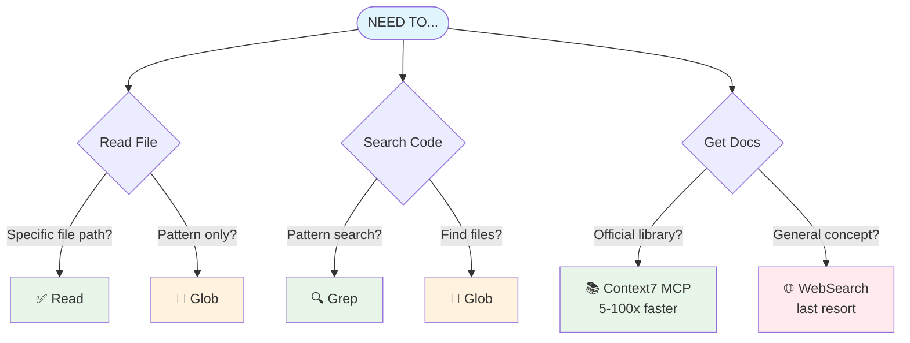
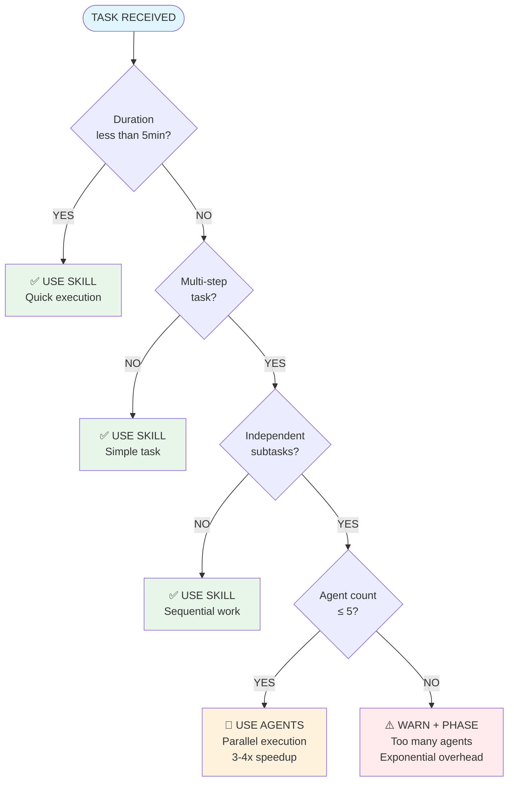
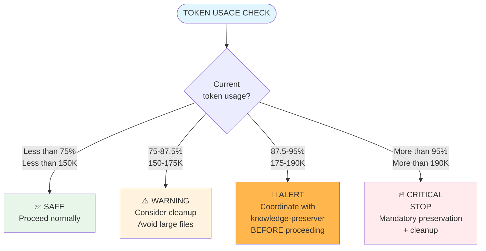

# Comprehensive Decision Trees & Flowcharts

**Master orchestration flowcharts + decision matrices for systematic task execution.**

---

## Overview

This reference provides visual decision trees and matrices for:
- Master orchestration workflow
- Task type classification
- Tool selection logic
- Error recovery workflows
- Skill vs Agent decisions

**Usage**: Referenced throughout `SKILL.md` all 5 phases for systematic decision-making.

---

## Master Orchestration Flowchart

### Mermaid Diagram



### ASCII Fallback

```
┌─────────────────────────────────────────────────────────────────┐
│                    EVERY REQUEST STARTS HERE                     │
└───────────────────────────┬─────────────────────────────────────┘
                            │
                            ▼
        ┌────────────────────────────────────────┐
        │  PHASE 1: REQUEST ANALYSIS             │
        │  - Score prompt quality 0-100          │
        │  - Enhance if <70                      │
        │  - Apply patterns (Template, CoV, etc.)│
        └────────────────┬───────────────────────┘
                         │
                         ▼
        ┌────────────────────────────────────────┐
        │  PHASE 2: WORKFLOW PLANNING            │
        │  - Classify task type                  │
        │  - Estimate complexity                 │
        │  - Plan execution strategy             │
        └────────────────┬───────────────────────┘
                         │
                         ▼
        ┌────────────────────────────────────────┐
        │  PHASE 3: SKILL COORDINATION           │
        │  - Match keywords to skills            │
        │  - Evaluate agent delegation           │
        │  - Suggest activations                 │
        └────────────────┬───────────────────────┘
                         │
                         ▼
        ┌────────────────────────────────────────┐
        │  PHASE 4: TOOL OPTIMIZATION            │
        │  - Identify parallel opportunities     │
        │  - Prefer MCP over alternatives        │
        │  - Check token budget                  │
        └────────────────┬───────────────────────┘
                         │
                         ▼
        ┌────────────────────────────────────────┐
        │  PHASE 5: QUALITY ASSURANCE            │
        │  - Run validation gates                │
        │  - Apply self-validation (CoV)         │
        │  - Determine circuit breaker state     │
        └────────────────┬───────────────────────┘
                         │
                         ▼
                ┌────────────────┐
                │ EXECUTE TASK   │
                └────────────────┘
```

---

## Task Type Classification Tree

### Mermaid Diagram



### ASCII Fallback

```
                    USER REQUEST
                         │
                         ▼
              ┌──────────┴──────────┐
              │                     │
         Describes               Describes
          Problem               Solution
              │                     │
              ▼                     ▼
      ┌───────┴───────┐     ┌──────┴──────┐
      │               │     │             │
   Existing       New Need  Improve    Change
    Issue                  Existing   Structure
      │               │     │             │
      ▼               ▼     ▼             ▼
    BUG          FEATURE  OPTIMIZATION  REFACTOR

Examples:
- BUG: "ONNX inference crashes on startup"
- FEATURE: "Add dark mode to settings"
- OPTIMIZATION: "Speed up database queries"
- REFACTOR: "Convert StatefulWidget to Riverpod"
```

### Task Type Properties

| Task Type | Workflow | Typical Duration | Typical Skills |
|-----------|----------|------------------|----------------|
| **Bug** | Symptom → Diagnose → Fix → Test | 15-60min | Domain-specific + testing-enforcer |
| **Feature** | Requirements → Design → Implement → Test | 1-4 hours | 2-4 domain skills + testing-enforcer |
| **Optimization** | Profile → Identify → Optimize → Validate | 30-90min | performance-specific + database-query-reviewer OR ml-performance-optimizer |
| **Refactor** | Audit → Plan → Refactor → Validate | 1-3 hours | flutter-architecture-quality-enforcer + domain skills |

---

## Tool Selection Decision Matrix

### Mermaid Diagram



### ASCII Fallback

```
                      NEED TO...
                          │
       ┌──────────────────┼──────────────────┐
       │                  │                  │
       ▼                  ▼                  ▼
   Read File         Search Code       Get Docs
       │                  │                  │
       ▼                  ▼                  ▼
┌──────────────┐  ┌──────────────┐  ┌──────────────┐
│ Specific     │  │ Pattern      │  │ Official     │
│ file path?   │  │ search?      │  │ library?     │
│              │  │              │  │              │
│ YES → Read   │  │ YES → Grep   │  │ YES → MCP    │
│ NO  → Glob   │  │ NO  → Glob   │  │ NO  → Search │
└──────────────┘  └──────────────┘  └──────────────┘
```

### Tool Selection Table

| Goal | Known Information | Best Tool | Example |
|------|-------------------|-----------|---------|
| Read specific file | Exact file path | **Read** | `Read lib/services/database_service.dart` |
| Find files by pattern | Pattern (*.dart, **/*.test.dart) | **Glob** | `Glob pattern="lib/screens/**/*.dart"` |
| Search code content | Keyword/regex | **Grep** | `Grep pattern="@riverpod" path="lib/providers"` |
| Official docs | Library name (Flutter, Riverpod, Isar) | **Context7 MCP** | `mcp__context7__get-library-docs("/riverpod/riverpod")` |
| General search | Concept/tutorial | **WebSearch** | `WebSearch "Riverpod best practices 2025"` (last resort) |
| Complex workflow | Multi-step process | **Task (Agent)** | `Task subagent_type="Explore" prompt="Find all DI violations"` |

### Parallel Execution Decision

```
           MULTIPLE OPERATIONS?
                  │
            ┌─────┴─────┐
            │           │
            ▼           ▼
       DEPENDENT?    INDEPENDENT?
            │           │
            ▼           ▼
      SEQUENTIAL    PARALLEL
                        │
                        ▼
                 SINGLE MESSAGE
                  (Multiple tool calls)
```

**Example - Parallel**:
```
Task: "Optimize CameraService"

Operations:
1. Read camera_service.dart
2. Grep "CameraController"
3. Context7 MCP "camera plugin best practices"

Decision: INDEPENDENT → Execute in parallel (single message, 3 tool calls)
Result: ~2s total (vs 6s sequential) = 3x faster
```

**Example - Sequential**:
```
Task: "Create provider file then update routes"

Operations:
1. Write game_provider.dart (provider file)
2. Edit app_router.dart (add provider reference)

Decision: DEPENDENT (Step 2 needs provider name from Step 1) → Sequential
Result: Write → Confirm → Edit
```

---

## Error Recovery Workflow

```
                    ERROR DETECTED
                          │
                          ▼
               ┌──────────┴──────────┐
               │                     │
               ▼                     ▼
        RECOVERABLE?            UNRECOVERABLE?
               │                     │
         ┌─────┴─────┐               │
         │           │               │
         ▼           ▼               ▼
    TRANSIENT?   PERMANENT?      BLOCKER
         │           │               │
         ▼           ▼               ▼
    RETRY WITH   SURFACE TO    CIRCUIT OPEN
     BACKOFF        USER           │
         │           │              │
         └───────────┴──────────────┘
                     │
                     ▼
            PROVIDE FALLBACK
```

### Error Type Classification

| Error Type | Recoverable? | Action | Example |
|------------|--------------|--------|---------|
| **Transient** | ✅ YES | Retry with exponential backoff | Network timeout, rate limit |
| **Permanent** | ❌ NO | Surface to user, no retry | 404 Not Found, invalid syntax |
| **Blocker** | ❌ NO | Circuit OPEN, provide fallback | Missing critical info, invalid credentials |

---

## Skill vs Agent Decision Flowchart

### Mermaid Diagram



### ASCII Fallback

```
                  TASK RECEIVED
                       │
                       ▼
              ┌────────────────┐
              │ Duration < 5min?│
              └────┬──────────┬─┘
                   │ YES      │ NO
                   ▼          ▼
            ┌──────────┐  ┌──────────────┐
            │USE SKILL │  │ Multi-step?  │
            └──────────┘  └───┬──────┬───┘
                              │ YES  │ NO
                              ▼      ▼
                      ┌──────────┐  USE
                      │Independent│  SKILL
                      │subtasks? │
                      └───┬──┬───┘
                          │  │
                    YES ┌─┘  └─┐ NO
                        ▼      ▼
                 ┌──────────┐  USE
                 │Count ≤ 5?│  SKILL
                 └───┬──┬───┘
                     │  │
               YES ┌─┘  └─┐ NO
                   ▼      ▼
            ┌──────────┐  WARN
            │USE AGENTS│  (Phase)
            └──────────┘
```

### Decision Table

| Duration | Multi-Step | Independent | Count | Decision |
|----------|------------|-------------|-------|----------|
| <5min | N/A | N/A | N/A | **USE SKILL** |
| >5min | No | N/A | N/A | **USE SKILL** (simple) |
| >5min | Yes | No | N/A | **USE SKILL** (sequential) |
| >5min | Yes | Yes | ≤5 | **USE AGENTS** (parallel) |
| >5min | Yes | Yes | >5 | **WARN + PHASE** |

---

## Token Budget Decision Tree

### Mermaid Diagram



### ASCII Fallback

```
                TOKEN USAGE?
                     │
        ┌────────────┼────────────┐
        │            │            │
        ▼            ▼            ▼
    <75%       75-87.5%      87.5-95%      >95%
    (Safe)     (Warning)      (Alert)    (Critical)
        │            │            │            │
        ▼            ▼            ▼            ▼
   PROCEED      CONSIDER     COORDINATE    MANDATORY
   NORMALLY     CLEANUP      knowledge-    CLEANUP
                             preserver
```

### Action Matrix

| Threshold | Tokens | Symbol | Action | Urgency |
|-----------|--------|--------|--------|---------|
| <75% | <150K | ✅ | Proceed normally | None |
| 75-87.5% | 150-175K | ⚠️ | Consider cleanup, avoid large files | Low |
| 87.5-95% | 175-190K | 🚨 | Coordinate with knowledge-preserver BEFORE proceeding | High |
| >95% | >190K | 🔥 | STOP, mandatory preservation + cleanup | Critical |

---

## Complexity Estimation Decision Tree

```
               COUNT FILES
                    │
      ┌─────────────┼─────────────┐
      │             │             │
      ▼             ▼             ▼
   1 file       2-3 files      4+ files
      │             │             │
      ▼             ▼             ▼
  DURATION?     DURATION?     DURATION?
      │             │             │
  ┌───┴───┐     ┌───┴───┐     ┌───┴───┐
  ▼       ▼     ▼       ▼     ▼       ▼
<15min  >15min 15-45min >45min <45min  >45min
  │       │     │       │     │       │
  ▼       ▼     ▼       ▼     ▼       ▼
 LOW   MEDIUM MEDIUM   HIGH  MEDIUM VERY HIGH
```

### Complexity Properties

| Complexity | Files | Duration | Skills | Agents | Confidence |
|------------|-------|----------|--------|--------|------------|
| **Low** | 1 | <15min | 1 | 0 | >90% |
| **Medium** | 2-3 | 15-45min | 2-3 | 0-1 | 70-90% |
| **High** | 4+ | >45min | 3+ | 2-5 | <70% |
| **Very High** | 10+ | >2 hours | Many | >5 ⚠️ | <50% |

---

## Validation Gate Decision Tree

```
            RUN ALL 5 GATES
                   │
      ┌────────────┼────────────┐
      │            │            │
      ▼            ▼            ▼
  ALL PASS    WARNINGS    FAILURES
      │            │            │
      ▼            ▼            ▼
   CIRCUIT     CIRCUIT      CIRCUIT
   CLOSED      HALF-OPEN     OPEN
      │            │            │
      ▼            ▼            ▼
  PROCEED    CLARIFY OR   SURFACE +
            PROCEED W/    FALLBACK
             CAVEATS
```

### Gate Failure Actions

| Gate | Failure | Circuit State | Action |
|------|---------|---------------|--------|
| DI | `new Service()` detected | OPEN | Refuse to proceed, show correct DI pattern |
| Performance | Query >250ms | HALF-OPEN | Warn, suggest @Index() |
| Tests | Coverage <60% | HALF-OPEN | Warn, suggest test generation |
| Security | Hardcoded secret | OPEN | Refuse to proceed, show secure storage |
| M3 | Custom colors | HALF-OPEN | Warn, suggest Theme.of(context) |

---

## Integration Points

### SKILL.md Phase References

| Phase | Decision Trees Used |
|-------|---------------------|
| **Phase 1** | Task Type Classification Tree |
| **Phase 2** | Complexity Estimation Tree, Task Type Properties |
| **Phase 3** | Skill vs Agent Flowchart, Agent Count Decision |
| **Phase 4** | Tool Selection Matrix, Parallel Execution Decision, Token Budget Tree |
| **Phase 5** | Validation Gate Tree, Error Recovery Workflow |

---

## Best Practices

### DO ✅

- Follow decision trees systematically (don't skip steps)
- Document which tree/matrix guided decision
- Update trees when discovering new patterns
- Use trees for training (show user decision logic)
- Combine multiple trees for complex decisions

### DON'T ❌

- Make decisions without consulting trees (leads to inconsistency)
- Override tree logic without documented rationale
- Ignore complexity warnings (tree thresholds are research-backed)
- Use outdated tree versions (update with project evolution)
- Skip intermediate nodes (each node has purpose)

---

**Last Updated**: 2025-10-28
**Integration**: Referenced throughout SKILL.md all 5 phases
**Maintenance**: Update trees when new patterns emerge
