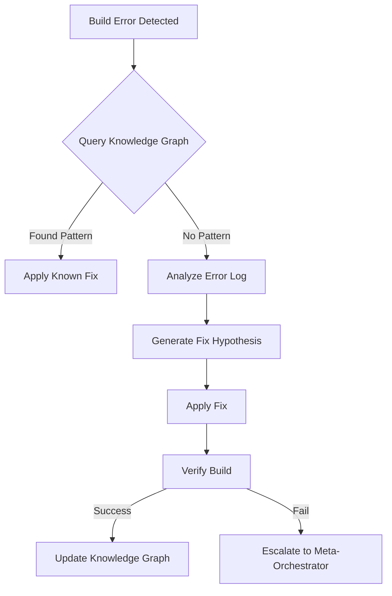

# Self-Healing Loop

## Overview
A closed-loop system that detects build failures and attempts to fix them automatically before escalating to a human.

## Workflow

## Execution Steps

### 1. Diagnosis
- Read `build.log` or error output.
- Extract error code and stack trace.
- Query `knowledge-graph-builder.py` for similar past errors.

### 2. Remediation
- **Scenario A (Known Issue)**: Apply the fix linked in the Knowledge Graph.
- **Scenario B (New Issue)**: 
  - Use `error-analyzer` to understand the root cause.
  - Generate a minimal code change.
  - Apply change using `multi_replace_file_content`.

### 3. Verification
- Run `npm run build` to verify the fix.
- If successful, log the error-fix pair to the Knowledge Graph for future use.

## Safety
- Max retry attempts: 3
- If fix involves deleting files, require `adaptive-meta-orchestrator` approval.
